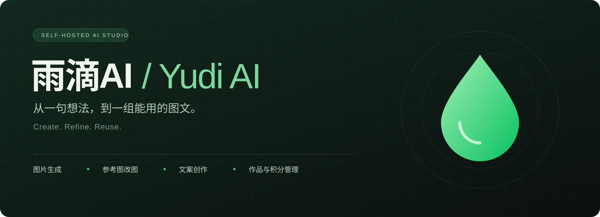
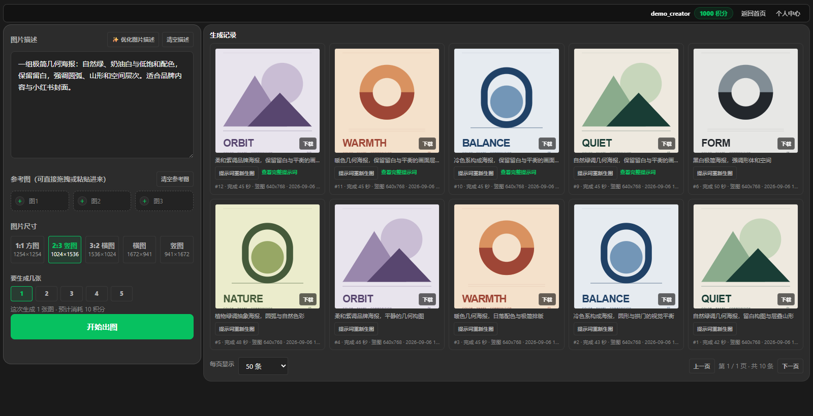
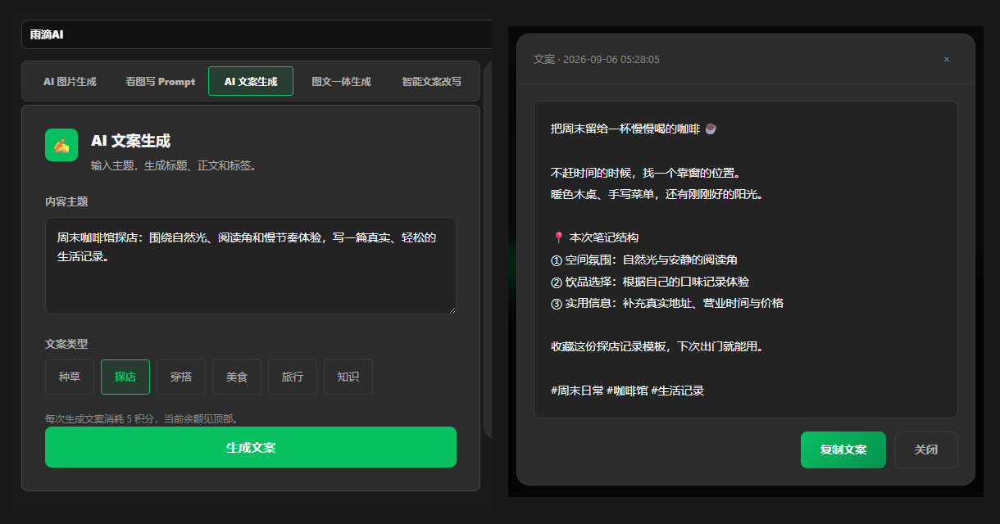
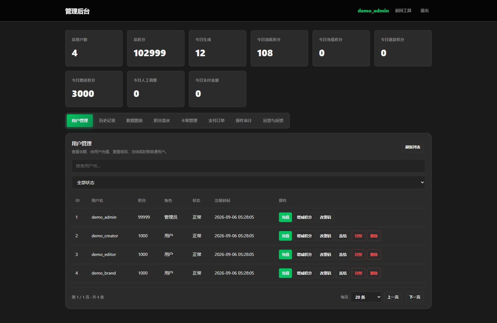
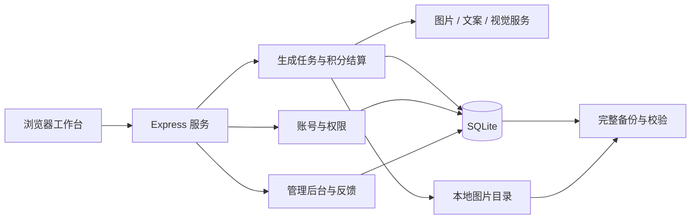

<div align="center">



# 雨滴AI · Yudi AI

**自托管 AI 图文创作工作台**

图片生成 · 参考图改图 · 文案创作 · 历史复用 · 积分管理

<p>
  
  
  
  
</p>

[产品预览](#产品预览) · [功能亮点](#功能亮点) · [快速开始](#快速开始) · [配置说明](#配置说明) · [部署与备份](#部署与备份)

</div>

---

雨滴AI将图片、文案和创作记录放在同一个工作台中。你可以从一句描述生成画面，用参考图继续调整，完成小红书内容起稿，再把结果保存下来供后续下载和复用。

项目采用 **Express + SQLite + 原生 HTML / CSS / JavaScript**，不需要单独搭建前端构建服务。适合个人创作者、电商运营和需要自托管创作工具的小团队。

> [!NOTE]
> 当前支持本地部署与卡密兑换。支付宝、微信自动支付尚未接入；在线订单创建保持关闭。

## 产品预览

### 01 · 画面工坊

从描述到画面，从参考图到新版本。输入区与生成记录并排呈现，支持多图创作、预览、下载和再次使用提示词。



### 02 · 小红书工作台

图片生成、文案起稿、文案改写、图文一体和看图提取提示词，按创作任务切换；已有内容保存在账号历史中。



### 03 · 管理后台

用户、积分、卡密、历史、订单和操作审计集中管理；运营页补充任务成功率、耗时、反馈、上游账单与备份状态。



<sub>以上为真实页面的独立演示环境截图。账号、记录与数值均为演示数据；几何插画为原创界面示例，不代表模型实测生成质量，不包含实际用户资料或私人作品。</sub>

## 功能亮点

| 创作能力 | 使用方式 |
| --- | --- |
| **文生图与参考图改图** | 输入画面描述，或点击、拖拽、粘贴参考图继续创作 |
| **画面工坊批量生成** | 页面单次选择 1–5 张；应用默认不限制生图并发与排队数量 |
| **描述优化与图片反推** | 优化当前图片描述，或从参考图中提取可复用的提示词 |
| **小红书内容创作** | 支持种草、探店、穿搭、美食、旅行、知识等文案类型，以及改写与图文一体生成 |
| **作品历史与复用** | 查看任务进度，预览、下载图片，复制文案，复用提示词和参考图 |
| **草稿保留** | 提交生图后保留输入；文字草稿按账号保存，24 小时内可恢复 |

| 管理能力 | 当前实现 |
| --- | --- |
| **积分与任务账本** | 扣费可追踪；相同任务号防重复扣费；失败和少出图按规则退款 |
| **中断恢复** | 画面工坊尝试恢复未完成任务；普通收费任务核对已保存结果并退回未完成部分 |
| **账号与权限** | 用户和管理员角色、账号冻结、密码重置、登录状态撤销 |
| **反馈与运营** | 站内反馈、查询码查回复、管理员回复、任务统计和账单录入 |
| **完整备份** | 数据库快照、历史引用图片、文件校验清单和 Windows 定时备份 |

生图结果区保持简洁：积分明细在个人中心查看，问题反馈从帮助中心进入。

## 快速开始

### 1. 获取项目并安装依赖

推荐使用 **Node.js 24 LTS**。当前依赖包含原生 SQLite 模块；请使用受支持的 Node.js 版本。

```bash
git clone https://github.com/888helloworld/yudi-ai-studio.git
cd yudi-ai-studio
npm ci
```

### 2. 创建本地配置

在项目根目录创建 `.env`。下面是本地 HTTP 使用的最小示例；已有配置时，请按需修改，不要覆盖现有密钥。

```dotenv
NODE_ENV=development
HOST=127.0.0.1
PORT=3001
ALLOWED_ORIGIN=http://127.0.0.1:3001
TRUST_PROXY_HOPS=0

# 必须替换：登录签名密钥与首次创建管理员使用的密码
JWT_SECRET=replace_with_your_random_secret
ADMIN_USERNAME=admin
ADMIN_PASSWORD=replace_with_your_strong_password

# 本机 HTTP；公网 HTTPS 部署使用 Secure Cookie
AUTH_COOKIE_SECURE=false
AUTH_RETURN_TOKEN=false
LOCAL_REGISTER_WITHOUT_INVITE=true
ENABLE_MOCK_PAYMENT=false

# 0 表示不限生图执行/任务/排队数量
XI_XU_MAX_ACTIVE_JOBS=0
XI_XU_MAX_ACTIVE_JOBS_PER_USER=0
XI_XU_MAX_QUEUED_JOBS=0
```

使用下面的命令生成随机 `JWT_SECRET`，将输出填入 `.env`：

```bash
node -e "console.log(require('crypto').randomBytes(32).toString('hex'))"
```

接着根据需要使用的功能，填写对应模型服务配置：

| 功能 | 配置项 |
| --- | --- |
| 画面工坊生图 / 改图 | `XI_XU_API_BASE_URL` + `XI_XU_API_KEY`，使用支持对应图片接口的服务 |
| 小红书及电商普通生图 | `ARK_API_KEY` |
| 文案生成 / 改写 | `DEEPSEEK_API_KEY` |
| 看图提取提示词 | `XI_XU_API_BASE_URL` + `XI_XU_API_KEY` + `XI_XU_VISION_MODEL` |
| 图片描述视觉润色 | `DEEPSEEK_VISION_API_KEY`，未配置时使用 `DEEPSEEK_API_KEY`；模型需支持对应视觉能力 |

更多参数可查阅 [`.env.example`](.env.example)。该模板偏向生产环境，不应原样用于本机 HTTP 登录。

### 3. 启动并使用

```bash
npm run check
npm start
```

打开 **[http://127.0.0.1:3001](http://127.0.0.1:3001)**。

首次启动会自动初始化数据库，并使用配置中的账号和密码创建管理员。管理员已存在时，修改 `.env` 不会自动重置其密码。

| 页面 | 路径 |
| --- | --- |
| 首页 | `/` |
| 画面工坊 | `/image-studio.html` |
| 小红书工作台 | `/xhs.html` |
| 个人中心 | `/profile.html` |
| 管理后台 | `/admin.html` |
| 帮助与反馈 | `/help.html` |

## 配置说明

### 模型与出图行为

画面工坊当前使用 `gpt-image-2`，质量固定为 `medium`。小红书普通生图、图文一体的图片部分及亚马逊主图使用独立的图片服务；文案使用 DeepSeek。具体服务可用性取决于所配置的提供方。

- 画面工坊上游失败时按任务规则处理，不会静默换成其他图片模型。
- 请求尺寸与最终输出可能不同；实际图片和历史记录中的宽高为准。
- 应用默认不限制生图并发；请求频率限制和上游服务限额是独立配置。
- 当前不提供 4K 输出保证，也不提供自动发布到小红书的功能。

<details>
<summary><strong>展开：图片接口优先级与任务配置</strong></summary>

<br>

配置 `OPENAI_IMAGE_API_KEY` 或 `OPENAI_IMAGE_API_BASE_URL` 时，图片请求优先使用这组配置；否则使用 `XI_XU_API_BASE_URL` 和 `XI_XU_API_KEY`。

| 参数 | 说明 |
| --- | --- |
| `XI_XU_MAX_ACTIVE_JOBS` | 全站同时执行的画面工坊任务数；默认 `0`，不限 |
| `XI_XU_MAX_ACTIVE_JOBS_PER_USER` | 单账号运行中与排队中的任务总数；默认 `0`，不限 |
| `XI_XU_MAX_QUEUED_JOBS` | 全站排队数量；默认 `0`，不限 |
| `XI_XU_IMAGE_RATE_LIMIT_PER_MIN` | 图片接口每分钟请求次数；默认 `30` |
| `XI_XU_GENERATE_TIMEOUT_MS` / `XI_XU_EDIT_TIMEOUT_MS` | 图片服务等待时间；`0` 关闭对应超时限制 |
| `NEW_USER_BONUS_POINTS` | 新用户初始赠送积分；默认 `1000` |

当前页面支持 JPG、PNG、WebP 等常见参考图，上传后会检查真实文件类型和像素大小。服务端有效单文件限制同时受单文件与总上传配置约束，不能只看扩展名或一个大小参数。

</details>

### 积分规则

基础价格由 [`config/points.js`](config/points.js) 统一定义。

| 操作 | 积分 |
| --- | ---: |
| 图片生成 / 改图 | 10 / 张 |
| 文案生成 | 5 / 次 |
| 文案改写 | 3 / 次 |
| 图文一体 | 5 + 10 × 图片张数 |
| 看图提取提示词 / 视觉润色 | 5 / 次 |

积分是站内结算单位，不等于上游现金成本。当前支持卡密兑换与管理员积分操作；自动在线收款尚未开放。

## 架构概览



```text
.
├── server.js                  # 服务入口与路由装配
├── routes/                    # 账号、生成、积分、反馈与后台接口
├── services/                  # 模型调用、任务调度与业务服务
├── repositories/              # 数据读写与事务
├── database/                  # SQLite 连接与表结构
├── middleware/                # 鉴权、上传检查与收费请求上下文
├── image-studio/               # 画面工坊前端模块
├── xhs-tool/                   # 小红书工作台前端模块
├── admin/                      # 管理后台前端模块
├── scripts/                    # 检查、备份与维护脚本
├── test/                       # 自动化回归测试
└── docs/                       # 文档与项目展示图片
```

### 主要接口

| 方法 | 路径 | 用途 |
| --- | --- | --- |
| `POST` | `/api/auth/login` | 登录并设置 HttpOnly Cookie |
| `POST` | `/api/xi-image/jobs/generate` | 创建画面工坊文生图任务 |
| `POST` | `/api/xi-image/jobs/edit` | 创建参考图改图任务 |
| `GET` | `/api/xi-image/jobs/:id` | 查询画面工坊任务 |
| `POST` | `/generate-copy` / `/rewrite` | 文案生成 / 改写 |
| `GET` | `/api/user/history` | 查询当前账号的作品历史 |
| `GET` | `/api/user/tasks/:id` | 查询普通收费任务及其结算结果 |
| `POST` | `/api/cdkey/redeem` | 兑换积分 |
| `POST` | `/api/feedback` | 提交问题反馈 |

浏览器默认使用 Cookie 登录；需要 Bearer Token 的旧客户端可显式开启 `AUTH_RETURN_TOKEN`。用户数据接口校验账号归属，后台接口要求管理员权限。

## 部署与备份

### 运行模式

当前架构面向 **单实例、自托管部署**。使用同一个数据库时，应保持一个服务实例负责生成任务和恢复流程。

公网部署前配置 HTTPS、可信反向代理、安全 Cookie 和备份位置，并运行：

```bash
npm run check:production
```

该命令列出配置检查结果；详细发布流程见 [部署说明](docs/DEPLOYMENT.md)。

### 完整备份

```bash
npm run backup:full
```

完整备份包含数据库快照、历史引用的图片，以及 SHA-256 校验清单；执行后会检查数据库完整性、外键和图片文件。`.env` 不包含在备份包内。

```text
backups/
└── snapshot-<timestamp>-<id>/
    ├── data.db
    ├── manifest.json
    └── uploads/
```

验证指定快照：

```bash
node scripts/backup-full.js --verify "<snapshot-directory>"
```

Windows 可安装每天凌晨 03:17 执行的定时备份任务：

```powershell
powershell -NoProfile -ExecutionPolicy Bypass -File scripts/install-backup-task.ps1
```

完整备份默认保留 7 天，可配置为 1–30 天。需要独立副本时，将 `BACKUP_MIRROR_DIR` 指向独立磁盘或受控网络盘；同一硬盘上的备份不属于异地备份。恢复步骤见 [运行与恢复说明](docs/RELEASE_2026-09-05.md#恢复步骤)。

## 安全与数据

- **登录保护**：HttpOnly / SameSite Cookie、登录失败锁定、密码变更后旧令牌失效。
- **访问隔离**：生成记录与私有图片校验用户归属，管理员操作记录审计日志。
- **上传与下载检查**：检查文件头、大小和像素；外部图片下载校验地址并拦截内网目标。
- **积分一致性**：数据库事务、唯一业务号和任务账本用于减少重复扣费与重复退款。
- **资料管理**：注销清理创作资料，必要财务记录按保留策略处理；具体规则见 [隐私政策](privacy.html)。

密钥保存在服务端配置中，不返回浏览器。`.env`、数据库、用户图片、日志与备份不应提交到仓库。

## 开发与验证

```bash
npm run check
npm test
npm audit --omit=dev --registry=https://registry.npmjs.org
```

测试覆盖积分结算、重复请求、任务恢复、权限隔离、登录锁定、反馈查询和备份校验。模型相关自动测试使用模拟上游，不代表真实服务的画质或可用性保证。

| 命令 | 说明 |
| --- | --- |
| `npm start` | 启动本地服务 |
| `npm run check` | 检查 JavaScript 语法 |
| `npm test` | 运行回归测试 |
| `npm run backup` | 仅备份数据库 |
| `npm run backup:full` | 完整备份数据库及引用图片 |
| `npm run audit:uploads` | 只读检查疑似孤儿图片 |
| `npm run check:production` | 查看生产配置检查结果 |

## 文档导航

| 文档 | 内容 |
| --- | --- |
| [产品框架](docs/PRODUCT_FRAMEWORK.md) | 使用场景、功能边界与产品定位 |
| [部署说明](docs/DEPLOYMENT.md) | 服务部署与运行数据保护 |
| [版本与恢复记录](docs/RELEASE_2026-09-05.md) | 当前能力、运维命令与恢复步骤 |
| [后续路线](docs/ROADMAP.md) | 已实现功能与后续迭代条件 |
| [指标与事件](docs/METRICS_AND_EVENTS.md) | 统计口径与事件约定 |
| [发布检查清单](docs/RELEASE_CHECKLIST.md) | 发布前的验证项目 |

---

<div align="center">

**让灵感有结果，让创作可继续。**

[反馈问题](https://github.com/888helloworld/yudi-ai-studio/issues) · [浏览代码](https://github.com/888helloworld/yudi-ai-studio) · [查看提交记录](https://github.com/888helloworld/yudi-ai-studio/commits/main)

</div>
